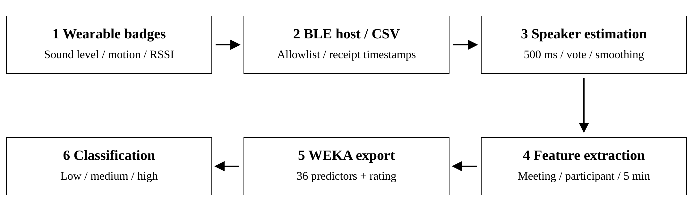
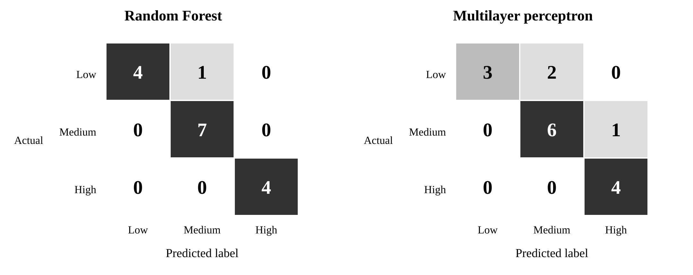

# Estimating Perceived Meeting Effectiveness from Wearable Sound and Motion Signals: A Smart Badge Feasibility Study

Austin Sternberg, Bishop Harsch, and JungYoon Kim

Smart Communities and IoT Laboratory, Kent State University

## Abstract

Wearable sensing can characterize conversational participation while reducing the need to retain speech content. This paper presents a Bluetooth Low Energy smart badge pipeline for estimating perceived meeting effectiveness from sound-level and motion measurements. The system collects participant-associated sensor streams, estimates a dominant speaker in 500 ms bins using adaptive sound thresholds and cross-badge comparison, and summarizes speaking activity, turn-taking, and participation balance. Meeting, participant, and temporal-window summaries are combined into 36 numerical predictors for three-class classification in WEKA. A feasibility evaluation used 16 labeled session records, including meeting segments and lectures, with reported 10-fold cross-validation. A retrospective audit recovered the classification inputs and reproduced all 576 predictor values from saved feature tables. The classification results show 15 of 16 correct predictions for Random Forest (93.75%; Cohen's kappa = 0.9024) and 13 of 16 for a multilayer perceptron (81.25%; kappa = 0.7091). A six-badge speaker-state comparison reproduces 50.70% agreement across 5,373 bins, but treats unknown manual labels as inactive and includes a recording interval represented in the classification dataset. It is therefore not independent validation against fully annotated speech states. The results therefore support preliminary feasibility of classifying the available meeting labels, rather than established measurement accuracy or generalization to new groups. The principal contributions are an inspectable sensing-to-feature pipeline, explicit definitions of its interaction measures, and an analysis of the validation requirements for content-minimizing meeting analytics. Larger independently labeled datasets, grouped evaluation, and stronger speaker-state validation are needed before deployment as an effectiveness assessment tool.

**Keywords:** wearable sensing; sociometric badges; meeting effectiveness; speaker activity; participation balance; Bluetooth Low Energy.

## 1. Introduction

Small-group meetings involve more than the content of individual statements. The distribution of speaking time, intervals of silence, and transitions between speakers provide observable descriptions of how participants share the conversational floor. These descriptions may be useful to researchers studying collaboration and to facilitators reviewing group interaction. They do not, by themselves, establish whether participants are attentive, whether a decision is correct, or whether a meeting achieves its goals.

Wearable sociometric systems have previously used sound, motion, and proximity measurements to study organizational behavior. Olguin Olguin et al. demonstrated a wearable platform connecting measured interaction patterns with self-reported organizational outcomes. Their work provides a basis for studying nonverbal interaction features without requiring a full linguistic account of a meeting. [1](https://doi.org/10.1109/TSMCB.2008.2006638)

This study develops a smart badge workflow for a narrower task: classifying perceived meeting effectiveness from sensor-derived interaction summaries. Each participant wears a badge that transmits sound level, acceleration, and received signal strength indicator (RSSI) to a central host. A heuristic labeler estimates speaker activity, feature extraction summarizes the meeting at several temporal and social levels, and a classifier assigns a low, medium, or high effectiveness label. The transmitted measurements summarize acoustic activity rather than retaining an intelligible audio recording.

Two inference stages must be distinguished. Speaker-state estimation assigns a badge identity or a no-speaker state to a time bin. Meeting classification maps aggregated features to an effectiveness label. Success at the second stage does not establish accuracy at the first, and neither stage directly measures cognitive engagement. Accordingly, this paper uses *perceived meeting effectiveness* for the classification target and *estimated speaker activity* for the intermediate measurements.

This work contributes an integrated BLE acquisition and analysis system, a mapping from estimated speaker activity to a compact meeting representation, and a feasibility evaluation that distinguishes meeting-classification performance from the accuracy of intermediate measurements. The evaluation examines three-class effectiveness prediction across 16 session records and identifies the measurement and generalization challenges that remain for broader use.

## 2. Related Work

Sociometric badges established wearable measurement of conversational and physical interaction as an approach to organizational research. The platform described by Olguin Olguin et al. combines several sensing modalities and relates behavioral measurements to organizational outcomes. The present work follows this general approach but concentrates on a small-group pipeline based on acoustic level and movement, with RSSI retained in the collected records. It does not establish a new sensing modality or a new classification algorithm. [1](https://doi.org/10.1109/TSMCB.2008.2006638)

Open Badges provides an open-source framework for collecting and visualizing face-to-face interaction data using wearable devices or smartphones. Its emphasis on accessible instrumentation and feedback is closely related to the present implementation. Here, the specific engineering focus is the integration of heuristic cross-badge labeling, multilevel meeting features, and an export path for supervised classification. A controlled comparison would be needed to establish improvements over an existing badge system. [2](https://arxiv.org/abs/1710.01842)

Measurement validation is a separate requirement from system construction. Kayhan et al. examine wearable-badge sensing in structured meetings and develop validation procedures for sensor outputs and derived measures. Their study motivates checking both the input measurements and the interaction metrics built from them. This distinction is particularly relevant when an effectiveness classifier consumes automatically estimated speaking turns. [3](https://doi.org/10.3758/s13428-017-1005-4)

WEKA supplies the classification workbench used in the project. Its established data-mining environment allows the exported meeting representation to be evaluated using multiple learning algorithms. The contribution of the present system lies in the sensing and feature workflow rather than in modifying these algorithms. [4](https://doi.org/10.1145/1656274.1656278)

Wearable interaction studies address different prediction targets and evaluation settings. Accuracy estimates for face-to-face interaction detection, speaker identification, and meeting-effectiveness classification are therefore not directly comparable without a common task and dataset.

## 3. System and Methods

### 3.1. Acquisition and data representation

The BLE host implementation discovers devices from a configured address allowlist, connects to recognized badges, and receives notifications through sensor characteristics. Each decoded observation is appended to a unified CSV file with a host-generated receipt timestamp, badge identifier, optional participant name, sound level, RSSI, acceleration, and the original scalar-data payload. The collector also permits an optional fourth numeric field named `GR`; this field is not used in the meeting representation described below.

The acquisition system is designed for approximately six to eight concurrently connected badges and a nominal sensor reporting rate of 16 Hz. Effective reporting rates depend on firmware timing, BLE transport, and host scheduling; these operating targets should not be interpreted as a throughput benchmark. Microphone sampling occurs at a higher rate than the transmission of scalar acoustic measurements.

Badge firmware reduces microphone samples to a scalar acoustic-level measurement and summarizes movement from accelerometer readings. In the legacy implementation, the acoustic measurement is a power-like aggregate, and the movement summary is the sum of absolute changes across three axes. These values are device-specific and should not be interpreted as calibrated decibels or direct measurements of speech-induced vibration. Firmware variants that change signal definitions require recalibration before their outputs can be combined.

Time alignment uses host receipt timestamps rounded down to 500 ms bins. This establishes a common analysis grid, but it does not measure or correct device-to-host transport latency. Address allowlisting restricts which devices contribute records; it does not remove ambient acoustic noise. Figure 1 summarizes the implemented analysis path.

*Figure 1. Implemented research workflow. Speaker estimation and feature extraction run on recorded data; live acquisition does not imply a validated live effectiveness predictor. The 20 s descriptive-statistics utility is separate from the 36-predictor export path.*

### 3.2. Adaptive speaker-activity estimation

Let s_i(t) denote the sound measurement and a_i(t) the acceleration summary for badge i. The labeler first compares a short rolling mean of sound with a longer rolling quantile baseline:

**Equation 1.** v_i(t) = 1{mean_1s(s_i; t) > Q_0.45,60s(s_i; t)}.

The short window is 1 s and the baseline window is 60 s. The baseline requires at least ten observations. Sound and acceleration are separately normalized relative to each badge's rolling lower quartile and interquartile range (IQR):

**Equation 2.** z_i^x(t) = (x_i(t) - Q_0.25,60s(x_i; t)) / max(Q_0.75,60s(x_i; t) - Q_0.25,60s(x_i; t), 1), for x in {s, a}.

The implementation substitutes whole-recording quartiles where the rolling quartiles are initially unavailable. The lower bound of 1 in the denominator is expressed in the input signal's native units. It prevents division by a very small spread but also makes the normalization sensitive to signal scale.

The combined score is

**Equation 3.** c_i(t) = z_i^s(t) + 1.2 * clip(z_i^a(t), 0, 2.5).

Acceleration is intended to help distinguish the wearer's activity from sound received by neighboring badges. This rationale is a design hypothesis: the available evidence does not isolate speech-related vibration from gestures, posture changes, or unrelated movement.

A sample is eligible when its score is at least 0.75 and either the sound-presence condition holds or its score is at least 3.5. Within each 500 ms bin, the badge associated with the highest eligible sample score becomes the raw winner. A centered five-bin vote then requires at least three wins before the central bin is assigned active to a badge. Votes are counted over available observed bins; the threshold remains three at recording boundaries.

The code next applies per-badge post-processing intended to remove active runs shorter than 2 s, merge active periods separated by gaps shorter than 1.5 s, and fill brief inactive gaps shorter than 0.5 s. It then assigns a single `auto_speaker` per bin; when multiple active labels remain, the highest-scoring active badge determines the speaker. These parameters specify the default labeling configuration; their sensitivity to sensor conditions and participant behavior requires evaluation.

The output is thus a dominant-speaker-or-silence sequence. It does not explicitly represent simultaneous speakers. In addition, centered voting uses future bins and startup normalization may use later samples from the recording. The present algorithm is an offline procedure; a strictly causal streaming version would require changes and separate validation.

### 3.3. Temporal representations

The analysis uses several timescales with different purposes. They should not be treated as interchangeable training instances.

| Timescale | Role in the implementation |
| --- | --- |
| 500 ms | Cross-badge speaker comparison and subsequent bin-level aggregation |
| 1 s and 60 s | Short sound mean and adaptive threshold/normalization history |
| Five observed bins | Centered vote stabilizing the speaker assignment |
| 20 s | Rolling minimum, maximum, mean, and standard deviation in a separate sensor-processing utility |
| 5 min, configurable | Non-overlapping windows for interaction summaries and temporal trends |
| Entire meeting | One feature vector and one effectiveness label for classification |

The 20 s utility computes rolling statistics at sample timestamps. These descriptive signal summaries are separate from the meeting-classification representation: the WEKA exporter consumes meeting, participant, and temporal-window feature tables.

### 3.4. Turns and participation features

Raw observations are aggregated into one record per badge and 500 ms bin. Numeric summaries include sound and acceleration means and maxima, median RSSI, and normalized-score summaries. The feature extractor forms a speaker sequence with one state per observed bin and defines a turn as a maximal run with an unchanged non-silence speaker. A turn lasting fewer than two bins is marked as a micro-turn. This rule operates downstream of the labeler's longer active-run suppression, so micro-turn statistics depend on the full labeling procedure.

For B observed bins and S bins assigned a speaker, the speaking and silence ratios are S/B and (B - S)/B. The observed-bin duration is D = 0.5B seconds, and the turn rate is 60K/D for K turns. These quantities characterize observed coverage: if bins are missing, D can differ from the elapsed recording duration.

Let d_i denote the total estimated speaking duration of participant i and p_i = d_i / sum_j(d_j). Participation summaries include the dominant-speaker fraction max_i(p_i), normalized entropy, and the Gini coefficient:

**Equation 4.** H = -sum_i(p_i * ln(p_i)) / ln(n).

**Equation 5.** G = sum_i(sum_j(abs(d_i - d_j))) / (2 * n * sum_i(d_i)).

The current implementation computes these group-level quantities over participants with at least one detected turn. Silent participants are omitted from that denominator. Thus, low Gini or high entropy indicates balance among detected speakers, not necessarily inclusion of all attendees. The implementation assigns entropy zero when there is only one active participant; for positive speaking duration, the uncorrected Gini coefficient has a finite-group maximum of (n - 1)/n.

Participant summaries include speaking fraction, turn duration, immediate speaker transitions, and response latency after a different speaker. Variables named "interruptions" identify a speaker change with no intervening silence bin. At 500 ms resolution and with only one represented speaker, these transitions cannot establish conversational interruption or overlap.

For temporal features, the meeting is partitioned into configurable windows, with a default width of 5 min. The current code assigns a turn's full duration to the window in which it starts, including any portion extending beyond the window boundary. Window-level speaking-bin ratios and turn-duration summaries consequently use different boundary conventions. These details matter when interpreting within-meeting trends.

### 3.5. Meeting representation and labels

The WEKA exporter combines the three summary tables into a single row per meeting. It produces 36 numerical predictors: 12 direct meeting measures, 14 participant-aggregation measures, and 10 temporal measures. The effectiveness class gives 37 ARFF attributes. Meeting identifiers are retained in the CSV export but excluded from ARFF predictors.

| Feature family | Contents | Number |
| --- | --- | --- |
| Meeting summaries | Speaking and silence ratios; turn rate; mean and median turn duration; back-to-back ratio; mean gap; active-participant count; Gini; entropy; dominant-speaker fraction; micro-turn ratio | 12 |
| Participant aggregates | Mean and population standard deviation of seven measures: speaking fraction, mean turn duration, two immediate-transition ratios, response latency, self-succession count, and micro-turn ratio | 14 |
| Temporal aggregates | Population standard deviation and linear slope for five window measures: speaking ratio, Gini, turn rate, active-participant count, and back-to-back ratio | 10 |

Slopes are calculated against consecutive window indices rather than elapsed seconds. RSSI and raw acceleration are collected and available for inspection, but neither is directly included in the final 36 predictors; acceleration influences them indirectly through speaker labeling. Speaking and silence ratios are complementary, and other summaries may be redundant.

Meeting effectiveness is represented by manually assigned categories of low, medium, and high. During label entry, the workflow displays key interaction statistics to inform the rating decision, alongside qualitative descriptions of effectiveness. Consequently, the labels may depend on the same interaction measures used as predictors; they cannot be assumed to be independent outcome measurements. Independent ratings and a clearly specified rating instrument are needed to separate perceived effectiveness from the interaction measures used to predict it.

## 4. Experimental Evaluation

### 4.1. Dataset composition and evaluation protocol

The recovered classification dataset contains 16 session-level records, with five rated low effectiveness, seven medium, and four high. The CSV and ARFF agree in row order, labels, and all 36 predictors at the ARFF export precision of six decimal places. Reconstructing the exporter calculations from each record's saved meeting, participant, and window tables reproduces all 576 predictor values within numerical tolerance. No predictor values are missing; the mean and standard deviation of self-succession count are zero throughout, leaving 34 nonconstant predictors. This verifies the saved feature-to-export stage, not the preceding sensor-to-feature transformations.

Record identifiers distinguish nine SCI meeting records (four low, three medium, two high), five HacKSU meeting records (three medium, two high), and two CS1 lecture records (one low, one medium). Stored timestamps span October 10, 2025 through April 10, 2026. Record durations range from 29.15 to 76.26 min (median 45.41 min), totaling 747.56 min. Saved metadata list two to six participants per record; this is neither a verified attendance count nor a count of unique recruited participants. Two SCI records are successive segments on April 3 with the same recorded participant names. The unit of classification is consequently a labeled session record, not necessarily an independent meeting.

The recovered class counts agree with the principal reported experiment. However, original WEKA run logs, classifier settings, random seeds, fold assignments, and per-record predictions were not found in the local project files. The recovered inputs do not by themselves prove which exact configuration produced the reported scores. Recruitment, rating authorship and timing, consent, and the deployed firmware revision also remain undocumented in these files.

The reported evaluation used Random Forest and a multilayer perceptron in WEKA with 10-fold cross-validation. Table 1 preserves those historical results; neither classifier was retrained for this audit. Accuracy, Cohen's kappa, and probability-error measures originate from the reported model summaries, while macro-F1 and balanced accuracy are calculated from their integer confusion matrices. The local data recovery establishes input consistency but does not reproduce the cross-validation runs.

Additional evaluations address activity estimation and earlier classification experiments. The recovered speaker-state comparison contains 5,373 aligned 500 ms bins from a six-badge recording. Its timestamps match the start and end of the third HacKSU classification record, so it cannot be treated as an independent recording-level validation set. Binary activity comparisons operate on badge-level rows rather than bins. The overlap of the earlier ten-record effectiveness experiment and supervised activity experiment with the recovered classification records remains unresolved.

### 4.2. Meeting-classification results

Table 1 summarizes accuracy, Cohen's kappa, mean absolute error (MAE), and root mean squared error (RMSE) for both classifiers. Macro-F1 and balanced accuracy are calculated from the integer confusion matrices. These metrics complement overall accuracy by giving each effectiveness class equal weight.

*Table 1. Meeting-effectiveness classification with 10-fold cross-validation.*

| Metric | Random Forest | Multilayer perceptron |
| --- | --- | --- |
| Correct records | 15/16 | 13/16 |
| Accuracy | 93.75% | 81.25% |
| Cohen's kappa | 0.9024 | 0.7091 |
| Macro-F1, derived | 0.9407 | 0.8130 |
| Balanced accuracy, derived | 0.9333 | 0.8190 |
| MAE | 0.2129 | 0.1758 |
| RMSE | 0.2612 | 0.3269 |

Random Forest misclassified one low-effectiveness meeting as medium. The multilayer perceptron misclassified two low meetings as medium and one medium meeting as high. Both models correctly classified all four high meetings, although the multilayer perceptron also assigned high to one medium meeting. Four correct high-class predictions are insufficient to establish reliable performance in that class across new meetings or groups.

Figure 2 presents the confusion matrices. Random Forest recalls are 0.800, 1.000, and 1.000 for low, medium, and high effectiveness, respectively. Corresponding multilayer-perceptron recalls are 0.600, 0.857, and 1.000. The sole Random Forest error is a low-effectiveness meeting classified as medium. This error reduces medium-class precision to 0.875 while medium-class recall remains 1.000.

*Figure 2. Meeting-effectiveness confusion matrices for Random Forest and the multilayer perceptron. Rows are actual labels and columns are predicted labels. Each panel summarizes reported predictions for 16 session records.*

Always assigning the most common class, medium, would correctly label 7/16 meetings (43.75%) on this full dataset. This is a descriptive class-frequency reference, not a baseline evaluated within the reported cross-validation folds. A paired majority-class baseline should be included in a reproducible rerun.

The multilayer perceptron has lower reported MAE despite lower classification accuracy and higher RMSE. These error summaries describe different properties of the predicted probabilities and do not establish superior calibration. Calibration would require the underlying predictions and an appropriate assessment. Similarly, the two-meeting difference in correct classifications does not establish statistical superiority of one model.

### 4.3. Speaker-state comparison

The manual annotation workflow provides a graphical interface for inspecting sensor traces and assigning activity labels. The recovered comparison joins manual and automatic files by badge identifier and timestamp, then evaluates binary badge activity and a multiclass speaker state in 500 ms bins. Active is the positive binary class. Crucially, the manual file contains 45,491 active rows and 224,176 rows labeled unknown, with no explicit inactive rows. The comparison code maps unknown to inactive. Its results therefore quantify agreement under that coding convention, not verified speech-versus-silence accuracy over exhaustively annotated intervals.

An initial fixed-window activity heuristic had reported counts of 14,003 true positives, 54,898 false negatives, 6,388 false positives, and 140,693 true negatives across 215,982 badge observations. Its accuracy was 71.62%, precision 68.67%, recall 20.32%, and specificity 95.66%. For the subsequent adaptive comparison, the recovered saved rows reproduce 14,174 true positives, 31,992 false negatives, 6,943 false positives, and 219,087 true negatives: accuracy 85.70%, precision 67.12%, recall 30.70%, and specificity 96.93%, conditional on unknown being coded inactive. These configurations were not evaluated here on a common, independently annotated sample; their difference is not a controlled estimate of improvement.

The adaptive join contains 272,196 rows but only 269,617 unique badge-timestamp keys. The manual and automatic inputs contain respectively 50 and 2,479 duplicate keys beyond the first occurrence; the many-to-many join produces 2,579 excess rows. All unique keys match between the inputs. Thus, row totals are duplicate-weighted and the saved negative dropped-row count is a join artifact, not evidence of additional annotation coverage. These historical counts are retained for traceability rather than silently replaced by a deduplicated analysis.

Reconstructing the speaker-state comparison from the saved aligned rows exactly reproduces the reported integer matrix: 2,724 correct assignments among 5,373 bins (50.70% agreement). Table 2 gives its supports and recalls; macro-F1 is 0.4116 and balanced accuracy is 0.4106. In 1,445 bins (26.89%), multiple badges have manually active samples. The comparison resolves these bins to the badge with the most active rows, breaking ties alphabetically. This rule collapses annotated overlap and can be affected by duplicate-row weighting; no-speaker also inherits the unknown-to-inactive convention.

*Table 2. Speaker-state agreement with manual annotations. Support counts refer to aligned speaker-state observations.*

| Manual state | Support | Recall |
| --- | --- | --- |
| Badge 01 | 1,431 | 39.13% |
| Badge 04 | 304 | 33.22% |
| Badge 05 | 866 | 41.22% |
| Badge 07 | 197 | 18.27% |
| Badge 09 | 259 | 62.55% |
| Badge 10 | 357 | 19.61% |
| No speaker | 1,959 | 73.40% |

Reference active-speaker states are frequently assigned to no-speaker, with row percentages ranging from 29.73% to 63.45%. High reported classification accuracy therefore coexists with weak intermediate agreement, even under the saved annotation convention. The comparison spans the same recorded interval as one classification record and cannot establish validity across the dataset. Fully annotated intervals, explicit overlap handling, duplicate-safe alignment, and independent raters are required before interpreting these values as speaker-identification accuracy.

### 4.4. Earlier classification experiments

A separate ten-meeting effectiveness experiment contained three low, three medium, and four high ratings. Under stratified cross-validation, Naive Bayes classified seven meetings correctly (70%; kappa = 0.5455), while J48 classified all ten correctly (100%; kappa = 1.0000). The Naive Bayes errors comprised one low meeting assigned medium and two medium meetings assigned low. The fold count and relationship between this dataset and the 16-meeting dataset are not established. These results document an initial evaluation of the classification workflow; they do not support a direct ranking against the Random Forest and multilayer-perceptron results in Table 1.

An additional supervised activity experiment used a multilayer perceptron with a 66% training split and 15,850 held-out observations. It correctly classified 15,771 observations (99.5016%; kappa = 0.9900). The confusion matrix contains 7,888 correctly classified inactive observations, 7,883 correctly classified active observations, and 79 active observations assigned inactive. This sample-level binary result addresses a different target from meeting effectiveness and uses a learned classifier rather than the heuristic speaker estimator. Without separation by recording or participant, temporally related samples may occur on both sides of a percentage split. Its high accuracy therefore does not establish performance on new recordings or validate the deployed speaker-state pipeline.

### 4.5. Feature interpretation

Micro-turn ratio, back-to-back ratio, and speaking ratio describe distinct aspects of floor sharing and are candidate explanatory features. Their presence in the feature set does not establish their relative predictive importance. An importance analysis or ablation study is needed to determine whether each measure contributes beyond correlated predictors. Speaker-state errors also complicate interpretation because estimated turn counts and participation measures can reflect labeling errors as well as actual interaction.

## 5. Discussion and Limitations

### 5.1. Feasibility and construct validity

The implementation demonstrates a practical route from several wearable sensor streams to a fixed-length meeting representation. The reported classification results suggest that this representation contains information associated with the available effectiveness labels. The analysis does not establish what generated that association: actual conversational behavior, the labeling rubric, recurring groups, room conditions, or other correlated factors may contribute.

Speaking balance is also not equivalent to meeting quality. A briefing can appropriately concentrate speaking time in one person; a productive planning discussion may contain silence; an attentive participant may say little. The intended use should therefore remain contextual analysis and participant reflection until independent outcome measures establish a stronger interpretation. Cognitive engagement, fairness, and objective productivity are not validated targets in this study.

### 5.2. Sample size and evaluation independence

The dataset has 16 session records and 36 exported predictors, two of which are constant zero. Each changed prediction alters accuracy by 6.25 percentage points, making performance estimates sensitive to individual meetings. Ten-fold validation necessarily uses very small test folds, and the class counts do not permit every fold to contain all three classes. Neither the reported accuracy nor kappa resolves uncertainty from limited data or repeated participants.

Recurring membership is visible in the saved metadata: 55 of the 120 record pairs share at least one normalized participant-name string. Names are not verified participant identifiers, but the overlap and the two successive April 3 segments make record independence implausible. Class distributions also vary by recorded context: HacKSU has no low labels and CS1 has no high labels. Random record-level folds may therefore exploit recurring membership, session continuity, or context instead of transferable effectiveness patterns. A prospective evaluation should keep segments from the same session together and separate teams or participants across training and test sets. Preprocessing, feature selection, and tuning should occur within training folds. Context-held-out results would also need to account for the different class distributions in each context.

### 5.3. Reliability of intermediate measurements

The speaker-state comparison makes intermediate validation a priority. False silence can change speaking ratios and fragment turns; speaker swaps can distort participation balance. Smoothing can suppress brief acknowledgments or merge distinct events. Missing timestamps can also create apparent continuity because the turn extractor groups consecutive observed speaker states without explicitly breaking at unobserved time bins.

Several feature conventions affect interpretation of the interaction measures. Group-level equality measures omit non-speaking attendees. The back-to-back measure can count a meeting's first turn as having zero preceding gap. The self-succession implementation checks the immediately preceding state even when a silence interval intervenes, so its intended interpretation is not reliably represented. These conventions require targeted validation and sensitivity analysis before the resulting features are treated as behavioral measurements.

A useful next evaluation would separately measure speech presence, speaker identity, and downstream feature error against independently annotated intervals. Sound-only and sound-plus-motion ablations would test the value of acceleration. Threshold, voting, and smoothing sensitivity analyses would establish whether classification persists under reasonable labeling changes. Simultaneous speech should be annotated explicitly rather than forced into a single-speaker state.

### 5.4. Data minimization and participant privacy

The badge design reduces retained speech content by transmitting scalar summaries rather than a microphone waveform. The microphone nevertheless processes audio samples transiently to compute those summaries. Moreover, the collector can store participant names, device identifiers, timestamps, and behavioral histories. Avoiding intelligible audio retention is therefore a data-minimization property, not a guarantee of anonymity or complete privacy.

Participant privacy requires informed participation, defined retention periods, controlled access, and separation of identities from released behavioral data. These safeguards are particularly relevant in classrooms and workplaces, where participation may be influenced by existing power relationships. Data minimization at the sensor level does not replace these study-governance requirements.

### 5.5. Toward prospective feedback

The system supports live sensing and visualization, but effectiveness prediction currently relies on recorded-data processing and whole-meeting summaries. A prospective feedback system would need a causal speaker estimator, explicitly defined trailing-window features, a measured end-to-end delay, and validation on partial meetings. The Rev2 sensor viewer provides a possible instrumentation platform, not evidence that these prediction requirements have been met.

A larger study could evaluate whether descriptive feedback changes participation and whether participants find it useful. Such an intervention should be assessed separately from classification performance. Battery life, packet delivery, cross-device calibration, and performance as the number of concurrent badges increases also require measurement before claiming deployment scalability.

## 6. Conclusion

This BLE smart badge pipeline converts sound and motion measurements into estimated speaker activity and session-level interaction features. Reported 10-fold cross-validation on 16 records yielded 93.75% accuracy for Random Forest and 81.25% for a multilayer perceptron. The recovered files reproduce the classification inputs and speaker-comparison counts, but not the original classifier runs. Interpretation is constrained by feature-informed ratings, recurring participants, session segments, a mixed meeting-and-lecture sample, and incomplete speaker annotations. Independent ratings, validated intermediate measurements, and evaluation on groups separated from training data are needed to establish generalization.

## References

[1] D. Olguin Olguin, B. N. Waber, T. Kim, A. Mohan, K. Ara, and A. Pentland. "Sensible Organizations: Technology and Methodology for Automatically Measuring Organizational Behavior." IEEE Transactions on Systems, Man, and Cybernetics, Part B, 39(1), 43-55, 2009. [DOI: 10.1109/TSMCB.2008.2006638](https://doi.org/10.1109/TSMCB.2008.2006638).

[2] O. Lederman, D. Calacci, A. MacMullen, D. C. Fehder, F. E. Murray, and A. Pentland. "Open Badges: A Low-Cost Toolkit for Measuring Team Communication and Dynamics." arXiv:1710.01842, 2017. [Author preprint](https://arxiv.org/abs/1710.01842).

[3] V. O. Kayhan, Z. Chen, K. A. French, T. D. Allen, K. Salomon, and A. Watkins. "How honest are the signals? A protocol for validating wearable sensors." Behavior Research Methods, 50, 57-83, 2018. [DOI: 10.3758/s13428-017-1005-4](https://doi.org/10.3758/s13428-017-1005-4).

[4] M. Hall, E. Frank, G. Holmes, B. Pfahringer, P. Reutemann, and I. H. Witten. "The WEKA data mining software: An update." ACM SIGKDD Explorations Newsletter, 11(1), 10-18, 2009. [DOI: 10.1145/1656274.1656278](https://doi.org/10.1145/1656274.1656278).
